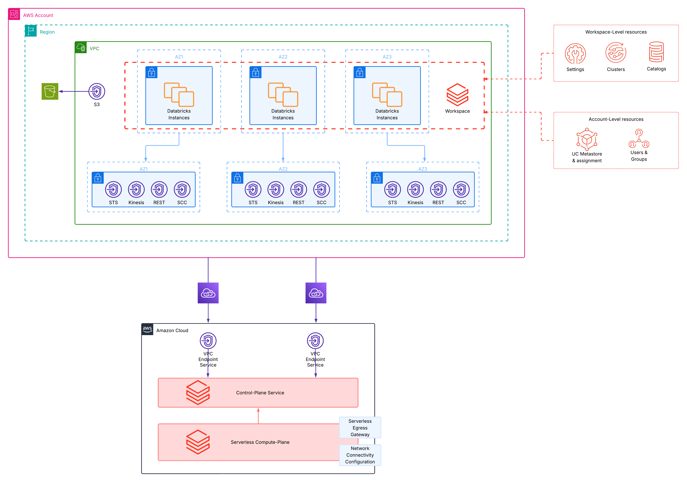

# aws-terragrunt-simple-mws

Simple terragrunt setup to deploy multiple isolated databricks workspaces with individual configurations for different
business-units, cloud-regions and environments.




### How-to
By default, the stack uses `AWS_PROFILE` to authenticate with AWS and environment variables to authenticate with Databricks.
You can change both according to your needs in the respective provider configurations. Follow the steps below to deploy this stack:

- Authenticate with your AWS Profile against your environment and make sure to set `AWS_PROFILE`. Alternatively, adjust the authentication method in the AWS provider configuration in `live/root.hcl`
- Set `DATABRICKS_ACCOUNT_ID`, `DATABRICKS_CLIENT_ID`, `DATABRICKS_CLIENT_SECRET` based on your service-principal used for deployments. Alternatively, adjust the authentication method in the Databricks provider configuration in `live/root.hcl`
- (Optional) Fill the `aws_account_id` in all `environment.hcl` configuration files to match your environments.
- Run the stack with
```shell
cd live
terragrunt run-all plan
terragrunt run-all apply
```
