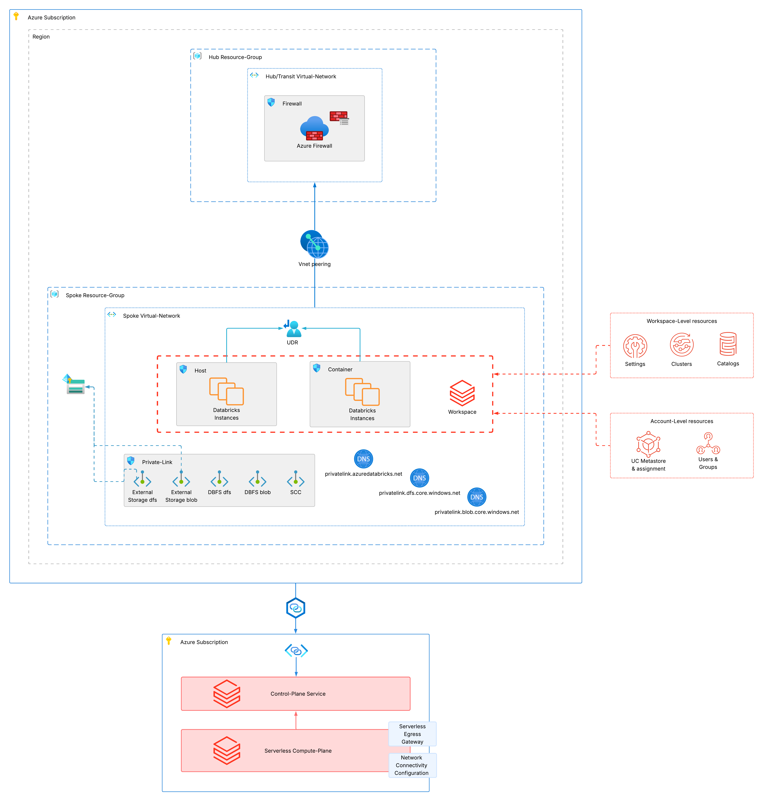

# azure-terragrunt-hub-spoke-mws

Sample terragrunt setup to deploy a hub and spoke architecture where isolated spoke databricks workspaces with
individual configurations for different business-units, cloud-regions and environments are peered with a
central hub/transit virtual network. All outbound connectivity is routed through the central hub's firewall / NVA.




### How-to
By default, the stack uses a Service-Principal to authenticate with Azure and Databricks. Make sure that your Service-Principal
is synced to Databricks (e.g. via Automatic-Identity-Management) or create the Service-Principal manually in Databricks.
You can change the method of authentication for both according to your needs in the respective provider configurations.
Follow the steps below to deploy this stack:

- Authenticate with your Azure Service-Principal against your environment and make sure to set `ARM_CLIENT_ID`, `ARM_CLIENT_SECRET`,
`ARM_TENANT_ID` and `ARM_SUBSCRIPTION_ID`. Alternatively, adjust the authentication method in the Azure provider configuration in `live/root.hcl`
- Set `DATABRICKS_ACCOUNT_ID`. Alternatively, adjust the authentication method in the Databricks provider configuration in `live/root.hcl`
- (Optional) Fill `databricks_account_admins` in `/live/../account-config/terragrunt.hcl` configuration file to add additional account-admins.
- Currently, Terragrunt does not support full bootstrap capabilities for Azure (at least not at the time writing this). Therefore, you
have to manually create the following resources for hosting the terraform-states (configured in `live/root.hcl`):
  - Resource-Group
  - Storage-Account
  - Storage-Container

  Note: state is currently kept **locally** (inside each unit's `.terragrunt-cache`) because the `remote_state` block in `live/root.hcl` is commented out. Once the resources above have been created, uncomment that block to switch to the shared Azure remote backend.
- Run the stack with
```shell
terragrunt plan --all --working-dir ./live
terragrunt apply --all --working-dir ./live
```

### Feature flags

Capabilities are toggled with boolean **feature flags** so you can enable or disable them per environment, region, or business unit without editing any module code.

A global baseline lives in `live/root.hcl` (`feature_baseline`). Each level of the hierarchy may optionally define its own flat `features = { … }` map, and these merge from least- to most-specific — so **the most-specific level wins**: `business-unit.hcl` overrides `region.hcl`, which overrides `environment.hcl`, which overrides the baseline (and an individual unit can still apply a final override). The `environment.hcl`, `region.hcl` and `business-unit.hcl` files already ship with empty `features = {}` stubs as ready-to-use override points along this chain.

```hcl
# e.g. in business-unit.hcl (or region.hcl / environment.hcl)
locals {
  features = {
    enable_classic_privatelink = false   # only list the flags you want to change
  }
}
```

| Flag | Default | Purpose |
|------|:------:|---------|
| `enable_serverless_connectivity` | `true` | NCC + Azure Network Security Perimeter (with the `AzureDatabricksServerless` service-tag rule) + storage NSP association — lets serverless compute reach the firewalled UC storage |
| `enable_network_policy` | `true` | Account network policy (egress `FULL_ACCESS` in `DRY_RUN`; ingress public + private) |
| `enable_classic_privatelink` | `true` | Classic Private Link for the workspace: ui/api + managed-storage `dfs`/`blob` private endpoints and their private DNS zones |
| `enable_storage_privatelink` | `true` | `dfs`/`blob` private endpoints for the UC external-location storage account |
| `enable_default_compute` | `true` | Default serverless SQL warehouse / compute; when `false`, also removes the auto-created starter warehouse |
| `disable_legacy_features` | `true` | Applies the account-level "disable legacy features" setting |
| `enable_cmk` | `false` | _Reserved — not yet implemented._ Customer-managed key encryption |
| `enable_security_compliance_addon` | `false` | _Reserved — not yet implemented._ Enhanced security & compliance add-on |
| `enable_inbound_privatelink` | `false` | _Reserved — not yet implemented._ Inbound (front-end) Private Link |

> Unlike the simple stack, there is **no `enable_outbound_nat` flag** — in the hub-spoke topology all spoke egress is routed through the central hub's Azure Firewall (VNet peering + a `0.0.0.0/0` route to the firewall, applied by the `hub-spoke-config` unit). The hub firewall and peering are the always-on, defining feature of this stack and carry no flag.
