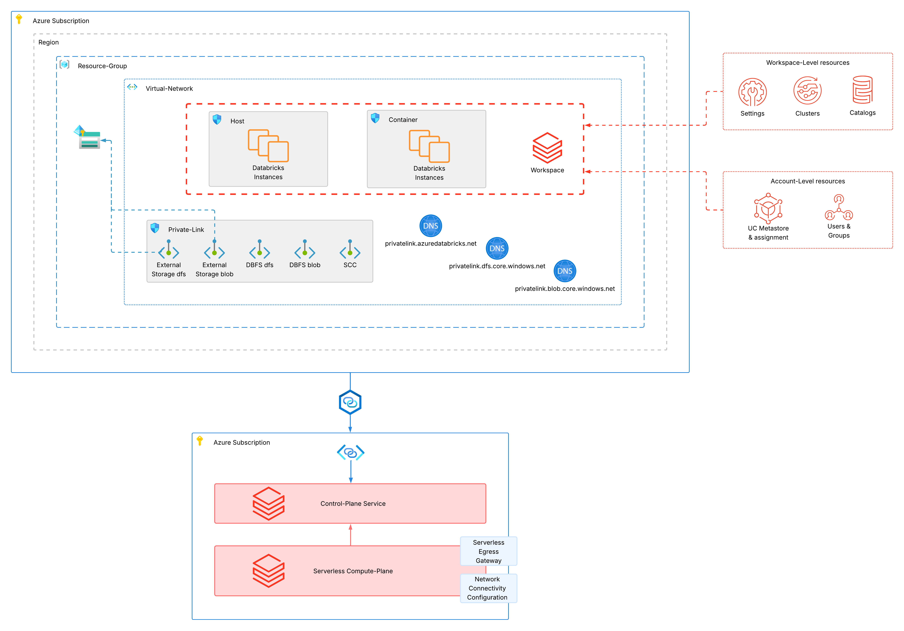

# azure-terragrunt-simple-mws

Simple terragrunt setup to deploy multiple isolated databricks workspaces with individual configurations for different
business-units, cloud-regions and environments.




### How-to
By default, the stack uses a Service-Principal to authenticate with Azure and Databricks. Make sure that your Service-Principal
is synced to Databricks (e.g. via Automatic-Identity-Management) or create the Service-Principal manually in Databricks.
You can change the method of authentication for both according to your needs in the respective provider configurations.
Follow the steps below to deploy this stack:

- Authenticate with your Azure Service-Principal against your environment and make sure to set `ARM_CLIENT_ID`, `ARM_CLIENT_SECRET`,
`ARM_TENANT_ID` and `ARM_SUBSCRIPTION_ID`. Alternatively, adjust the authentication method in the Azure provider configuration in `live/root.hcl`
- Set `DATABRICKS_ACCOUNT_ID`. Alternatively, adjust the authentication method in the Databricks provider configuration in `live/root.hcl`
- (Optional) Fill `databricks_account_admins` in `/live/../account-config/terragrunt.hcl` configuration file to add additional account-admins.
- Currently, Terragrunt does not support full bootstrap capabilities for Azure (at least not at the time writing this). Therefore, you
have to manually create the following resources for hosting the terraform-states (configured in `live/root.hcl`):
  - Resource-Group
  - Storage-Account
  - Storage-Container
- Run the stack with
```shell
terragrunt plan --all --working-dir ./live
terragrunt apply --all --working-dir ./live
```
